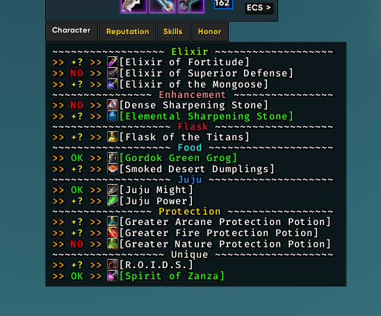

<!-- markdownlint-disable MD032 MD033-->
# **Fadestorm Consumable Manager**

  
   

---

**Fadestorm Consumable Manager** is a [WeakAura](https://www.curseforge.com/wow/addons/weakauras-2) for *World of Warcraft: Classic* written in Lua. It monitors the stock, application, and duration of a list of consumables & quantities, provided from a user-defined profile in the custom options.

## ◆ Overview ◆

* Indicates which consumables to bring according to your selected profile.
* Shows if you have enough supply, or if the item is stored elsewhere (bank, mail, etc)
* Marks whether a consumable's buff is missing, or is running low.
* Let's you customize when items show or hide through user-defined `rules`.

---

### ▲ Display ▲

* Attaches to the bottom of the character frame; only displaying when open.
* Display refreshes automatically while character pane is open *(every `1.5` seconds or upon certain events)*.
* Automatically grows/shrinks the frame depending on the text content.
* Each of the profile's consumables (if not hidden by a `rule`) will have one of each symbol:
    * **Quantity**
        - |  | Item supply in bags meets your preferences.
        - |  | Item supply is met, but items are outside your bags. By default, your bank. *Note: If [TSM](https://tradeskillmaster.com/) is installed, 'outside your bags' includes mailbox, other characters, etc. For Bind-On-Pickup items, only your bags & bank are checked.*
        - |  | Item supply is not met according to your preferences.
    * **Application**
        - |  | Item's buff is applied with a healthy duration, *or the item has no refreshable buff*.
        - |  | Item's buff is applied, but is considered to be low duration *(adjustable by the `low duration` slider)*.
        - |  | Item's buff is not applied or has fallen off.

---

### ❖ Profiles ❖

- **Profiles allow you to switch your desired consumable list.**
    - *Note: The loaded profile is always the first profile in the list. To re-arrange profiles, click the △/▽ Arrows.*
- Recommendation: Create profiles with meaningful names, e.g. `Myhunter: AQ40`.
- Provide names of items and the desired quantity to be brought for each item. *e.g. `Major Mana Potion`, `10`. Some equipment and mounts are supported.*
    - *Note: Profiles only include items/quantities pairs. No other settings are profile-specific.*
- Switching between profiles allows for flexibility. For example you could add `Onyxia Scale Cloak` to a profile meant for *Blackwing Lair*.
- *Note: For a list of all supported items, [consult the table here](https://github.com/KevinTyrrell/wa-fadestorm-consumable-manager/blob/0e3ef6a60f6684147251e8b40b30f001a457173c/fadestorm_consumable_manager.lua#L640). For missing items of merit, [create an issue here](#-issues-).*

---

### ⦿ Rules ⦿

* **Rules allow fine control over when items are to-be hidden**, as [large volumes of tracked items can yield an unwieldy display](res/ruleless-screenshot.png) otherwise.
* Rules consist of a list of `conditions`, each of which is evaluated against an item. If all conditions evaluate to `true` for a given item, *that item will be hidden from the display at that moment*.
* *Note: A rule can be enabled/disabled at any time by toggling the Rule Enabled checkbox.*

#### Conditions

- *A condition can be negated/inverted by toggling the `Negate Condition` checkbox.*

| Condition | Description |
|-----------|-------------|
| `In Dungeon/Raid` | `true` if the player is currently in a dungeon/raid |
| `In Rested Area` | `true` if the player is in a major city or inn |
| `Item Yields Buff` | `true` if the item can apply a long-standing aura. Items whose buffs cannot be continuously refreshed are not included (e.g. `Mighty Rage Potion`) |
| `Item In Inventory` | `true` if the player's bags contain at least one of the item |
| `Item Supply Healthy` | `true` if the player's bags meet the preferred supply of the item |
| `Player Max Level` | `true` if the player's character is max level |
| `Item Is Soulbound` | `true` if the item cannot be traded |

#### Suggested Rules

The following rules should be included in the WA import by default. Users are free to remove/modify them at their discretion. *Note: Recall that items which pass all conditions are hidden from the display.*

* [ `In Dungeon/Raid`, *negate*: `Item Yields Buff` ]
    - Only displays buff consumables while in a raid. *Separation of concerns*; only buff watching is relevant while raiding.
* [ `In Dungeon/Raid`, *negate*: `Item In Inventory` ]
    - Hides items in which you run out of supply during the raid. No longer productive to display out-of-stock items.
* [ *negate*: `In Dungeon/Raid`, *negate:* `In Rested Area` ]
    - Disables the entire display while out in the in-game world. The aura becomes less intrusive with this rule.
* [ `In Rested Area`, `Player Max Level`, `Item Supply Healthy` ]
    - Removes items as they meet quantity preferences on your main characters while in cities. Helps clear up what you still need to retrieve for raid.
* [ *negate*: `Player Max Level`, `Item Is Soulbound` ]
    - Does not show soulbound items while on a low level character. Soulbound items are not relevant to your bank character. *Note: Items like Onyxia Scale Cloak are marked as Bind-On-Equip, and thus will not be hidden.*

---

## ⚙ Screenshots ⚙

* ##### [ex. Configuration](res/config-screenshot.png)
* ##### [ex. Healer In-Raid](res/healer-rule-screenshot.png)
* ##### [ex. DPS In-Raid](res/dps-rule-screenshot.png)

---

## ⧻ Import ⧻

##### [Latest Release](../../releases/latest)

---

## ❂ Issues ❂

Found a bug? Have a feature request? Please [create an issue](https://github.com/KevinTyrrell/wa-fadestorm-consumable-manager/issues/new).

---

## ⌾ Changelog ⌾

* **v1.0.0** (Initial Release)
    - Text display, automatic refresh/show/hide
    - `rule` system implemented to reduce bloat

---

## ⎈ TODO ⎈

- [ ] Allow *item links* or *item ids* to be read in custom options fields.
- [ ] Dynamically adjust text & icon sizes.
- [ ] Move internal lib functions to a seperate library WA.
- [ ] Customizable display refresh rate.
- [ ] Rename `Negate` to `Negate Condition` in custom options.
- [ ] New `condition`: `Item Buff Healthy`, `true` if the item's buff is applied with a healthy duration.

---
