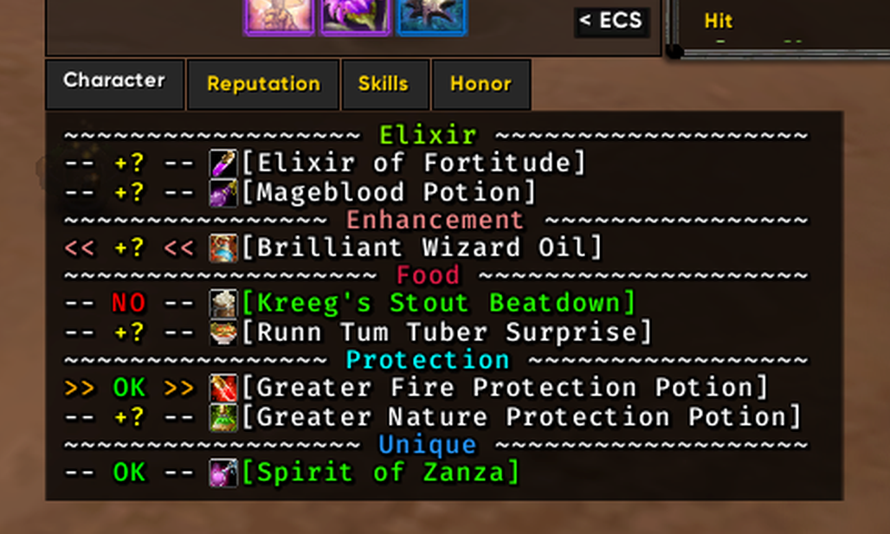
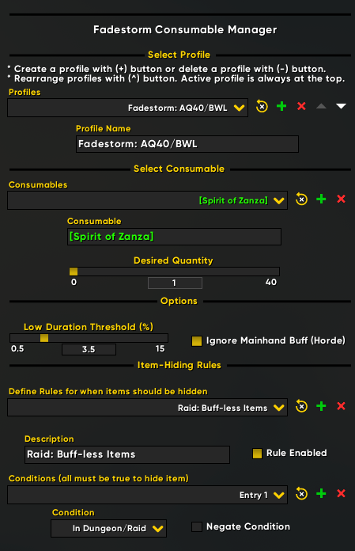

# Fadestorm Consumable Manager

**Fadestorm Consumable Manager** is a [WeakAura](https://www.curseforge.com/wow/addons/weakauras-2) for *World of Warcraft: Classic* written in Lua. It monitors the stock, application, and duration of a list of consumables & quantities, provided from a user-defined profile in the custom options.

  

---

## ✨ Features

- **Consumable tracking**
  - Reminds you which consumables to bring to raid
  - Displays if you have enough supply of a consumable in your bags
  - Indicates if your consumable supply is elsewhere (bank, mail, etc)
  - Warns if consumable buffs are missing or close to expiring
  - Supports weapon stones/oils (can ignore mainhand if horde)

- **Profiles**
  - Define different consumable lists for different raids/characters
  - Swap between profiles by shifting their order in the options

- **Display**
  - Display updates in real time while the character window is open
  - User-defined rules with conditions control when items are hidden
  - Items automatically show or hide as requirements are met or unmet

  

